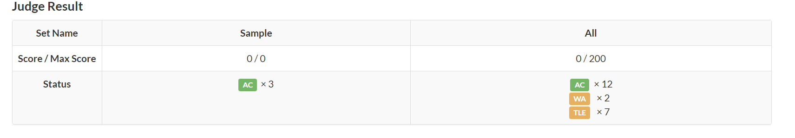

# B-A^A题解报告

## 前提

常规思路是用C++当中的pow()函数来做这一道题目，但是pow()函数也是有一定限制的，所以数据量稍微大一点就过不去这一道题，而且Atcoder没有像洛谷一样AC多少测试点给多少分的习惯，必须要把题调清楚才能拿分，所以你骗分基本是不可能的，像我花了差不多一个小时也没把这一道题写出来，还是太菜了。

## 题目大意

设计一个程序找到A这个能满足一下表达式的数字：
$$
A^{A} = B
$$
如果有就输出a，如果没有就输出-1。

正如之前所说我用pow()函数做这一题代码只能过一点点测试点，现在给大家看看我之前的代码。

```C++
#include <iostream>
#include <cstdio>
#include <cmath>
#include <iomanip>
#include <string>
#include <list>
#include <map>
#include <queue>
#include <vector>
#include <stack>
#include <algorithm>

typedef long l;
typedef long long ll;
typedef long double ld;
typedef unsigned long long ull;

using namespace std;

template<class T> void read(T &x) {
    x = 0; T f = 1; char c = getchar();
    for (; !isdigit(c); c = getchar()) if (c == '-') f = -1;
    for (; isdigit(c); c = getchar()) x = (x << 3) + (x << 1) + c - 48; x *= f;
}

template<class T> void write(T x) {
    if (x > 9) write(x / 10); putchar(x % 10 + 48);
}

template<class T> void print(T x,char ed = '\n') {
    if(x < 0) putchar('-'), x = -x; write(x), putchar(ed);
}

void solve()
{
    ull B;
    cin >> B;
    int ans = 0;
    for(int i = 1; i <= B; i++)
    {
        double m = pow(i,i);
        if(m == B)
        {
            ans ++;
            cout << i;
            break;
        }
    }
    if(ans <= 0)    cout << "-1";
}

int main()
{
    ios::sync_with_stdio(0);
    cin.tie(0);
    cout.tie(0);
    int T = 1;
    while(T--)
    {
        solve();
    }
    return 0;
}
```



## 分析

我没能成功实现计算表达式的方法，所以我在看了AA竞程dreamoon老师的视频之后终于知道我的问题出现在了哪里。

以下是dreamoon老师的AC代码，我们来拆开研究一下。

```C++
#include <iostream>
#include <cstdio>
#include <cmath>
#include <iomanip>
#include <string>
#include <list>
#include <map>
#include <queue>
#include <vector>
#include <stack>
#include <algorithm>

typedef long l;
typedef long long ll;
typedef long double ld;
typedef unsigned long long ull;

using namespace std;

template<class T> void read(T &x) {
    x = 0; T f = 1; char c = getchar();
    for (; !isdigit(c); c = getchar()) if (c == '-') f = -1;
    for (; isdigit(c); c = getchar()) x = (x << 3) + (x << 1) + c - 48; x *= f;
}

template<class T> void write(T x) {
    if (x > 9) write(x / 10); putchar(x % 10 + 48);
}

template<class T> void print(T x,char ed = '\n') {
    if(x < 0) putchar('-'), x = -x; write(x), putchar(ed);
}

void solve()
{
    ll B;
    read(B);
    for (int i = 1; i <= 15; i++)
    {
        ll var = 1;
        for (int j = 1; j <= i; j++)
        {
            var *= i;
        }
        if(var == B)
        {
            write(i);
            return;
        }
    }
    print(-1);

}

int main()
{
    ios::sync_with_stdio(0);
    cin.tie(0);
    cout.tie(0);
    int T = 1;
    while(T--)
    {
        solve();
    }
    return 0;
}
```
dreamoon老师写了两个for循环，我寻思这东西不是一个循环就能解决吗还在纠结这个问题，如果只用i <= 15的这个循环仅仅只能每次只能*i，没办法实现计算i的i次方，所以我们要写两个循环。

第二个for循环类似于计数器，可以实现计算i的i次方的方法，这个类似于一个模板，如果下次还需要用到类似于计算i的i次方的这种问题我们可以用上他。

## 结语

还是需要培养解决难题的能力，我也很庆幸能够弄懂这道题目的解决思路，在期中考试开始前半个小时我还在思考为什么不能用一个for循环这件事，也许我比较较真吧，不过没影响文化课考试，这一道题目也顺利解决了。